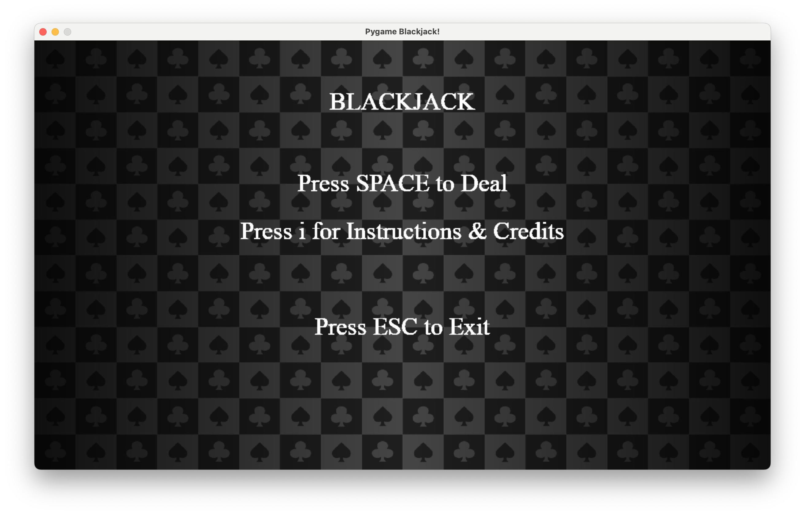
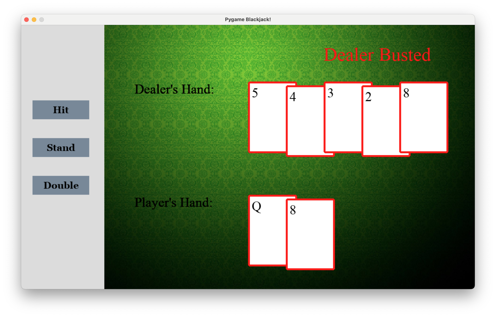

# Blackjack Game

Welcome to the Blackjack Game! This is a simple, console-based Blackjack game implemented in [Python]. The game is designed to be played in the command line and is a fun way to pass the time while practicing your Blackjack strategy.

## Introduction

Blackjack, also known as 21, is a popular card game where the goal is to beat the dealer by having a hand value closest to 21 without going over.

## Features

- Simple and intuitive Pygame interface
  
- Single player gameplay against a dealer AI
  
- Basic Blackjack actions such as Hit, Stand, Double Down.
- Betting system with a configurable starting balance
  

## Prerequisites

Before you can run the game, make sure you have the following installed:
- [Required Programming Language/Runtime] (e.g., Python 3.8, Java 11)
- [Any additional packages or dependencies required]
